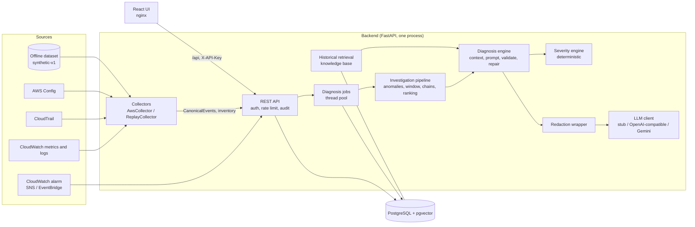

# Architecture

The system diagnoses an AWS incident in four steps. It collects telemetry for the incident's
resources and window, selects evidence with statistics and the dependency graph, asks an LLM
for a structured diagnosis that cites that evidence, and then checks every citation before
anything is shown. Each component can be switched off to measure what it contributes (the
conditions B1-B4, Full and A1-A5, `docs/evaluation.md`).

The LLM part is described in `docs/ai-architecture.md`; the tables in `docs/db-schema.md`; the
REST API in `docs/api.md`; running it in `docs/deployment.md`.

## Components



| Component | Code | Role |
|---|---|---|
| Contracts | `app/contracts/` | `CanonicalEvent`, taxonomy, `GroundTruth`, `Diagnosis`, evidence, correlation and historical records. Frozen; changes need a DECISIONS entry. |
| Interfaces | `app/interfaces/` | `Collector`, `Detector`, `GraphStore`, `VectorStore`, `LLMClient`, `Embedder`. External clients can only be built by the redacting factory (D67). |
| Collectors | `app/collectors/`, `app/offline/replay.py` | Real boto3 collectors (metrics, logs, CloudTrail, Config, inventory) and the replay collector; both emit identical CanonicalEvents (contract test, D31). |
| Offline dataset | `app/offline/` | Seeded simulator, 124 cases (10 fault types, red herrings, insufficient-evidence and compound cases), dev/test split, byte-identical regeneration. |
| Anomaly detection | `app/anomaly/` | z-score, MAD, moving average, rolling std, Isolation Forest on trailing minute-based windows. No LLM. |
| Dependency graph | `app/graph/` | NetworkX graph from inventory or dataset; upstream, downstream, blast radius and impact paths (D49). |
| Correlation | `app/correlation/` | Investigation window, onset estimate, event chains, candidate causes (temporal precedence + dependency path; never called causal). |
| Evidence ranking | `app/evidence/` | Section 2 score (temporal, resource, anomaly, semantic, dependency), top-K with stable evidence ids. |
| Retrieval | `app/rag/` | Embedders, vector stores (FAISS/NumPy, pgvector), historical corpus with leakage guard, re-ranking. |
| Diagnosis | `app/diagnosis/`, `app/ai/` | Context builder, versioned prompt, LLM clients, redaction, validator, citation verifier, repair, self-consistency. |
| Severity | `app/severity/` | Deterministic severity; the LLM's suggestion is advisory only. |
| Evaluation | `app/experiments/`, `app/evaluation/`, `app/baselines/` | Condition matrix, metrics, bootstrap statistics, reproducible experiment ids. |
| API | `app/api/`, `app/main.py` | REST routes, alarm webhook, lifecycle, async jobs, security middleware. |
| UI | `frontend/` | React pages: overview, diagnosis, timeline, metrics, logs, CloudTrail, graph. |

## One diagnosis, step by step

```mermaid
sequenceDiagram
    participant U as Analyst (UI)
    participant A as API
    participant J as Job worker
    participant P as Pipeline
    participant K as Knowledge base
    participant L as LLM (via redaction)
    participant D as Database
    U->>A: POST /api/incidents/{id}/diagnose
    A->>D: job PENDING
    A-->>U: 202 job_id
    J->>D: job RUNNING, incident INVESTIGATING
    J->>D: load events + inventory
    J->>P: anomalies, onset, window, chains, ranked evidence
    J->>K: retrieve similar past incidents (query = description + evidence)
    J->>L: prompt diag-v1 (ordered sections, token budget)
    L-->>J: JSON diagnosis
    J->>J: validate schema, citations, quoted values, historical influence
    alt invalid
        J->>L: one repair attempt
    end
    J->>J: review policy, deterministic severity
    J->>D: anomalies, evidence, diagnosis, severity; incident DIAGNOSED
    U->>A: GET /api/incidents/{id}/diagnosis
    A-->>U: diagnosis + the event behind every citation + dependency path
```

1. **Collect.** The incident names its affected resources and window. Telemetry comes from the
   real collectors (`python -m app.collectors.capture`, read-only IAM policy) or from the
   offline dataset (`POST /api/offline/import`). Both produce CanonicalEvents and inventory.
2. **Detect anomalies** on every metric series with trailing baselines (no look-ahead).
3. **Correlate.** Estimate the onset, build the investigation window (5/15/30/60 min before the
   alarm, 10 after), link signals along the impact graph into chains, and rank candidate causes.
4. **Rank evidence** with the five-component score; keep top-K (10), at most two items per
   group (one metric series, log template or API call), each with a stable `evd_` id.
5. **Retrieve** similar past incidents from a corpus that never contains test incidents.
6. **Diagnose.** Build the context (incident, timeline, anomalies, logs, CloudTrail, graph,
   historical) with every observed line tagged by its evidence id, send it through the
   redacting wrapper, validate the answer, and repair once if needed.
7. **Decide what can be shown.** The API returns the event behind each cited id; the UI shows a
   root cause only when the diagnosis is valid, is not `insufficient_evidence`, and every
   supporting citation resolves to an event of the incident (D102).

## Design choices that shape the system

- **Evidence first, LLM second.** Selection, correlation, graph reasoning and severity are
  deterministic and testable without a model; the LLM only interprets selected evidence.
- **Every conclusion carries its evidence.** Citations are verified twice: by the validator
  against the context, and by the UI against stored events.
- **Ablation by configuration.** Each component is a switch or a weight (`use_graph`,
  `use_rag`, `use_anomalies`, `use_chains`, weights), so the same code runs every condition.
- **Offline equals online.** The replay collector and the real collectors emit the same
  contract; the dataset and the API use the same pipeline.
- **One process.** Jobs and rate limits are in-process (D97). Several replicas would need a
  shared queue and limiter (`docs/known-limitations.md`).

## Repository layout

See the README, section "Repository layout". Decisions behind each part are in
`DECISIONS.md` (D1-D110), phase-by-phase status in `PROGRESS.md`.
