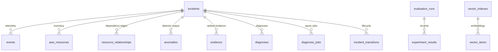

# Database schema

PostgreSQL 16 with the pgvector extension in Docker; SQLite for tests and the local demo (the
same models; `JSON` columns, and the vector column falls back to JSON, D2, D61). Models live in
`backend/app/db/models.py`; migrations in `backend/alembic/versions/`. A test checks that the
migrations produce exactly the models (`tests/test_db_and_api.py`), and every table and column
below is checked against the models by `tests/test_docs.py`.

| Migration | Adds |
|---|---|
| `0001` | the ten Phase 0 tables; `CREATE EXTENSION vector` on PostgreSQL |
| `0002` | `vector_indexes`, `vector_items` (pgvector `vector` column on PostgreSQL) (D61) |
| `0003` | incident lifecycle columns, `incident_transitions`, `diagnosis_jobs`, `audit_log` (D98) |

```bash
cd backend
alembic upgrade head                              # apply
alembic downgrade base && alembic upgrade head    # round trip (CI pgvector job)
alembic revision --autogenerate -m "describe"     # after changing a model
```

## Entity overview



`historical_incidents` and `audit_log` stand alone (`audit_log.incident_id` is a plain indexed
column, so audit rows outlive deleted incidents).

## Incidents and telemetry

### incidents
One incident per alarm (or offline import). Lifecycle and timings: `docs/api.md`, D92-D93.

| Column | Type | Notes |
|---|---|---|
| `id` | varchar(64) PK | `inc-...`; offline imports keep the dataset's opaque id |
| `title` | varchar(300) | |
| `description` | text | blinded symptom description (no root cause) |
| `status` | varchar(32) | DETECTED, INVESTIGATING, DIAGNOSED, MITIGATING, RESOLVED, CLOSED |
| `scenario_id` | varchar(64), null | offline dataset id when imported |
| `window_start`, `window_end` | timestamp, null | telemetry window |
| `affected_resources` | JSON | canonical resource ids (D32) |
| `created_at`, `updated_at` | timestamp | |
| `extra` | JSON | free-form attributes (alarm payload summary, notes) |
| `alarm_time` | timestamp, null | |
| `onset_at` | timestamp, null | estimated onset from the first diagnosis (D54) |
| `severity` | varchar(16), null | deterministic severity engine (D76), never the LLM's |
| `source` | varchar(32) | `api` (native JSON), `alarm-sns`, `alarm-eventbridge`, `replay` (offline import) |
| `dedup_key` | varchar(300), null, indexed | `account:region:alarm`; repeated alarms join the open incident (D95) |

### events
CanonicalEvents (Section 2 contract). `meta` is the contract's `metadata` (SQLAlchemy reserves
the name, D4).

| Column | Type | Notes |
|---|---|---|
| `event_id` | varchar(64) PK | deterministic hash (D6) |
| `incident_id` | FK incidents, null, indexed | |
| `timestamp` | timestamp, indexed | UTC |
| `source` | varchar(32) | metrics, logs, cloudtrail, config, alarm |
| `service` | varchar(64) | |
| `resource_id` | varchar(300), indexed | canonical id |
| `event_type` | varchar(128) | |
| `metric` | varchar(128), null | |
| `value` | float, null | |
| `severity` | varchar(16) | |
| `message` | text | secrets filtered in API responses (D96) |
| `meta` | JSON | per-source schema (D31) |
| `raw_ref` | varchar(512), null | pointer to the raw record |

### aws_resources
Inventory used to build the dependency graph.

| Column | Type | Notes |
|---|---|---|
| `id` | integer PK | |
| `incident_id` | FK incidents, null, indexed | |
| `resource_id` | varchar(300), indexed | canonical id |
| `resource_type` | varchar(64) | load_balancer, ecs_service, rds_instance, ... (D49) |
| `service` | varchar(64) | |
| `region` | varchar(32), null | |
| `attributes` | JSON | |

### resource_relationships
Typed dependency edges, dependent -> dependency (D49).

| Column | Type | Notes |
|---|---|---|
| `id` | integer PK | |
| `incident_id` | FK incidents, null, indexed | |
| `source_id` | varchar(300), indexed | |
| `target_id` | varchar(300), indexed | |
| `relation_type` | varchar(64) | routes_to, connects_to, secured_by, assumes_role, sends_to, polls |

## Analysis results

### anomalies
Statistical detector output of the latest diagnosis run (D98).

| Column | Type | Notes |
|---|---|---|
| `id` | integer PK | |
| `incident_id` | FK incidents, indexed | |
| `resource_id` | varchar(300) | |
| `metric` | varchar(128) | |
| `timestamp` | timestamp | |
| `score` | float | |
| `baseline` | float | |
| `observed` | float | |
| `method` | varchar(64) | zscore, mad, moving_average, rolling_std, isolation_forest |

### evidence
Ranked evidence of the latest run; ids are stable across runs (D56).

| Column | Type | Notes |
|---|---|---|
| `evidence_id` | varchar(64) PK | `evd_` + sha256(incident, event) |
| `incident_id` | FK incidents, indexed | |
| `event_id` | varchar(64) | |
| `rank` | integer | |
| `score` | float | Section 2 score |
| `components` | JSON | temporal, resource, anomaly, semantic, dependency |

### diagnoses
Every diagnosis is kept (newest first in the API).

| Column | Type | Notes |
|---|---|---|
| `id` | integer PK | |
| `incident_id` | FK incidents, indexed | |
| `experiment_id` | varchar(64), null, indexed | set for experiment runs stored with `--db` |
| `condition` | varchar(32) | Full, A1-A5, B4 |
| `model` | varchar(128) | |
| `prompt_version` | varchar(32) | `diag-v1` |
| `valid` | boolean | passed schema, citation and historical-influence checks |
| `output` | JSON, null | diagnosis, deterministic and advisory severity, citation report, self-consistency, retrieved ids, context statistics, prompt hash (D98) |
| `failure` | JSON, null | validator reasons when rejected |
| `latency_ms` | float | |
| `prompt_tokens`, `completion_tokens` | integer | |
| `created_at` | timestamp | |

### diagnosis_jobs
Async diagnosis jobs (D97).

| Column | Type | Notes |
|---|---|---|
| `id` | varchar(64) PK | |
| `incident_id` | FK incidents, indexed | |
| `status` | varchar(16) | PENDING, RUNNING, SUCCEEDED, FAILED |
| `params` | JSON | condition, samples |
| `created_at`, `started_at`, `finished_at` | timestamp | |
| `diagnosis_id` | integer, null | |
| `error` | text, null | scrubbed and truncated |
| `requested_by` | varchar(64) | actor (key hash) |

### incident_transitions
Lifecycle history with actors (D92).

| Column | Type | Notes |
|---|---|---|
| `id` | integer PK | |
| `incident_id` | FK incidents, indexed | |
| `from_status` | varchar(32), null | null for creation |
| `to_status` | varchar(32) | |
| `at` | timestamp | |
| `actor` | varchar(64) | `key-<hash>` or `system` |
| `note` | text | required to close an unresolved incident |

### audit_log
Every change and every denied request (D94).

| Column | Type | Notes |
|---|---|---|
| `id` | integer PK | |
| `at` | timestamp, indexed | |
| `actor` | varchar(64) | key hash or client address; never the key |
| `method` | varchar(8) | |
| `path` | varchar(300) | |
| `status_code` | integer | |
| `action` | varchar(64) | e.g. `incident.transition`, `diagnosis.start` |
| `incident_id` | varchar(64), null, indexed | |
| `detail` | JSON | |

## Knowledge base and experiments

### historical_incidents
Metadata of the historical corpus (separate from the test set, D62).

| Column | Type | Notes |
|---|---|---|
| `id` | varchar(64) PK | |
| `corpus_version` | varchar(64) | `historical-v1` |
| `summary` | text | |
| `taxonomy_label` | varchar(64) | |
| `resolution` | text | |
| `embedding_model`, `embedding_dim` | varchar(128) / integer, null | one model per index |
| `extra` | JSON | |

### vector_indexes
One row per vector index; model name and dimension are enforced on every add and search (D61).

| Column | Type | Notes |
|---|---|---|
| `name` | varchar(128) PK | |
| `model_name` | varchar(256) | |
| `dimension` | integer | |
| `created_at` | timestamp | |

### vector_items

| Column | Type | Notes |
|---|---|---|
| `index_name` | FK vector_indexes, PK | |
| `item_id` | varchar(128), PK | |
| `embedding` | pgvector `vector` (JSON on SQLite) | searched with `<=>` (cosine distance) |
| `payload` | JSON | |

### evaluation_runs
One row per experiment stored with `python -m app.experiments run --db` (D82).

| Column | Type | Notes |
|---|---|---|
| `experiment_id` | varchar(64) PK | `exp-...` |
| `split` | varchar(16) | dev or test |
| `label` | varchar(64) | `smoke-test / synthetic` for stub runs |
| `dataset_version` | varchar(64) | |
| `model`, `model_version` | varchar(128) | provider-reported versions |
| `prompt_version` | varchar(32) | |
| `config` | JSON | experiment config, settings, source hash, results hash |
| `started_at`, `finished_at` | timestamp | |

### experiment_results

| Column | Type | Notes |
|---|---|---|
| `id` | integer PK | |
| `experiment_id` | FK evaluation_runs, indexed | |
| `incident_id` | varchar(64), indexed | |
| `condition` | varchar(32) | |
| `run_index` | integer | |
| `retrieved_evidence` | JSON | |
| `diagnosis` | JSON, null | |
| `ground_truth` | JSON | |
| `metrics` | JSON | |
